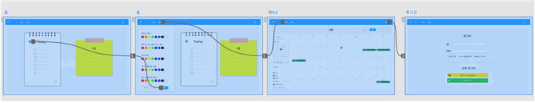
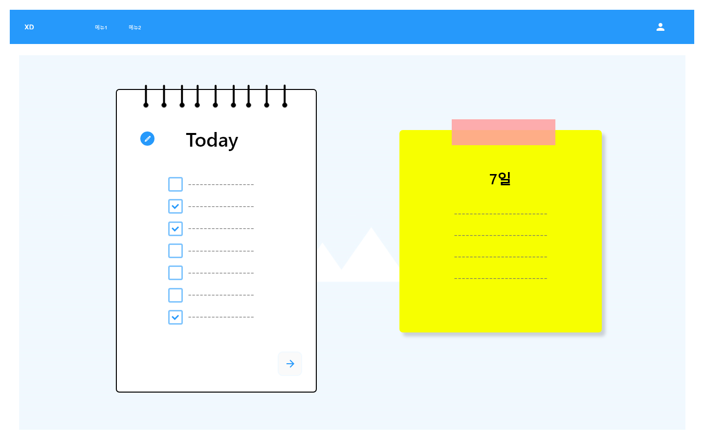
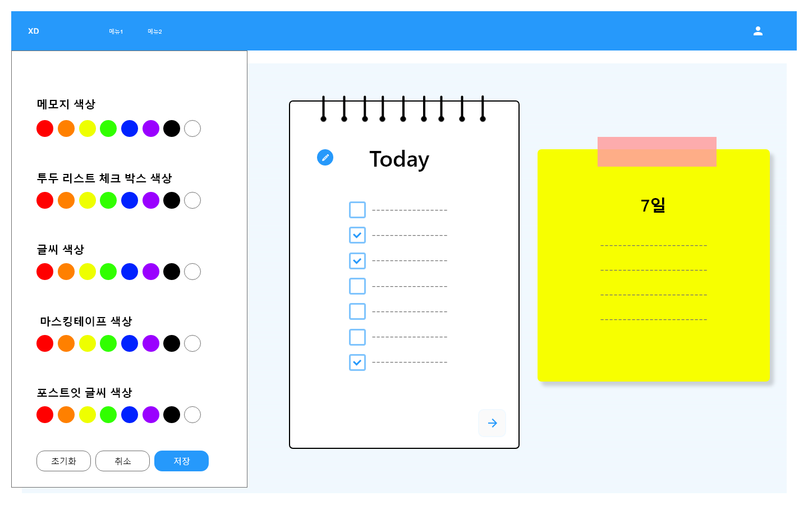
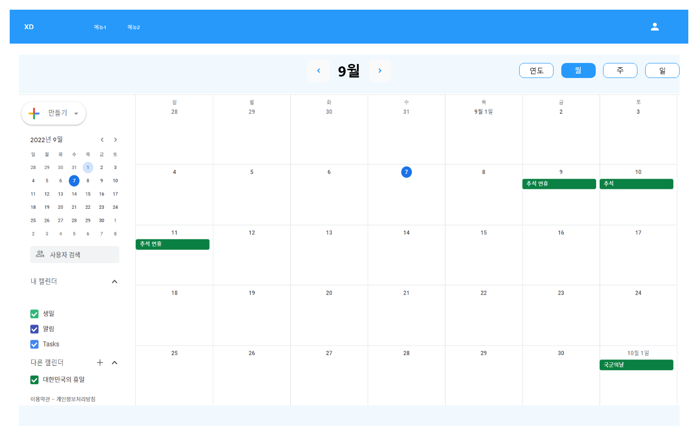
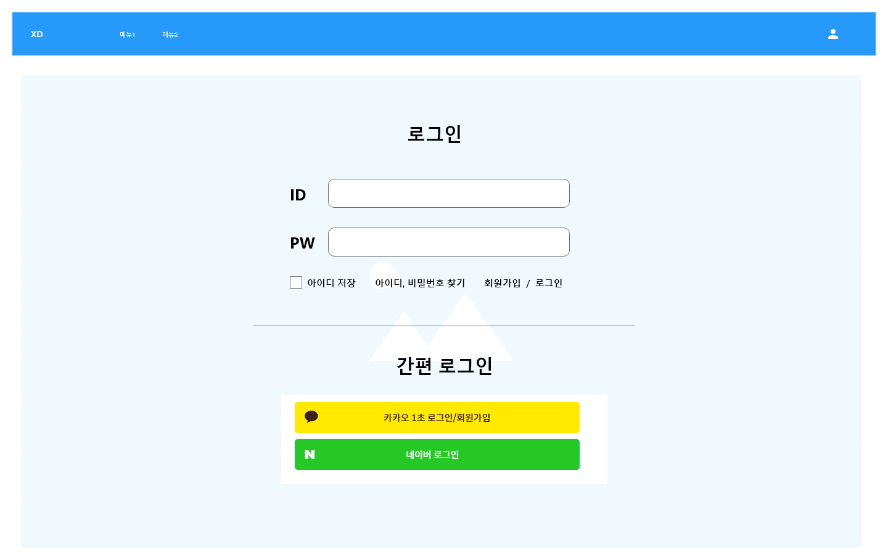

# capstone22 - 프뉴비(201840231 최기룡)
    팀 구성 : 배다슬(팀장, 프론트엔드), 최기룡(프론트엔드)
    팀명 정하기 : 프뉴비
    프로젝트 주제 정하기 : 일정 관리 웹 어플리케이션
    개발 환경 : HTML5 , CSS3 , JAVASCRIPT , REACT
    프로젝트 이름 : 오늘 하루를 책임질 '**투데이**'
    백엔드 없이 리액트로 일정관리 웹 어플리케이션을 만들고자 함.
    프로젝트 소개 사이트 : https://github.com/das0166/frontnewbe

## 2022.11.16
### 지난주까지 했던 일
+ 투두 리스트, 캘린더 다크모드 적용(useState 이용)
+ 일정 추가 기능을 할 때 date format 적용

+ 지난주까지 했던 일 중에서 어려웠던 일
    + 다크모드 적용시에 캘린더 라이브러리를 사용해 색상을 지정하는 것이 어려웠음(배경)
    + 일정 추가 시 날짜가 'YYYY-MM-DD'를 'YYYY년 MM월 DD일'로 변경하는데 어려움을 겪었음 -> DateFormat과 Locale을 사용하였음

+ 다음주까지 해야 할 일
    + 파일 저장 불러오기 기능(fileReader 사용)
    + 캘린더 일정 수정 삭제 기능


## 2022.11.02
### 지난주까지 했던 일 
+ 캘린더 일정 추가 구현
    + 데이터를 받아와 배열에 저장하는 부분에서 애를 먹었는데 useState와 onCreate를 이용하여 해결
    + 배열을 만들었지만 선택한 날짜 값이 불러와지지 않음
    + 새로고침을 하면 배열이 초기화 되는 것 해결 중 - localstorage

+ 다음주까지 해야할 일
    + 선택한 날짜값 받아서 배열에 저장
    + localstorage를 이용하여 배열이 유지되게 하기

## 2022.10.26
### 지난주까지 했던 일
+ 캘린더 일정 추가 구현
+ 배다슬 팀장과 같이 오른쪽 메모지 색상 변경 기능, 오늘의 일정 불러오기 기능 완성

### 지난주까지 했던 일 중에서 어려웠던 일
+ 일정 추가 기능
    + fullcalendar 라이브러리에 events를 적용하기 위해서 배열을 불러오는 것에 어려웠음.
    + 여러 참고 자료를 보며 공부하며 진행중

### 이번주(11.03)까지 해야할 일
+ 일정 추가 기능
+ 일정 수정 기능

## 2022.10.19
### 지난주까지 했던 일
+ 캘린더 일정 추가 클릭하여 레이어 팝업 나오게 완료
    + 강의 들으며 공부하며 완성
+ 팝업 안에서 추가 버튼을 누르면 캘린더에도 반영
+ 작품 PPT와 포스터 완성 및 발표 녹음

### 지난주까지 했던 일 중에서 어려웠던 부분
+ 일정 추가 클릭해서 레이어 팝업 나오게하는 것
    + useState를 이용하여 해결
+ 배다슬 팀장이 맡고 있던 색상 수정 버튼을 클릭하여 색상이 바뀌는 부분이 어려웠음
    + 같이 공부하며 useContext, useState를 활용하여 해결 및 디자인 재구성

### 이번주(10.26)까지 해야할 일
+ 캘린더 일정 추가 및 삭제 구현
+ 파일 저장 및 불러오기 기능

___
## 2022.10.12
+ 캘린더 라이브러리 이용하여 제작
    + 라이브러리 : fullCalendar
    + 폼과 다양한 이벤트가 있어 라이브러리 사용하여 원하는 기능 개발
    + 폼 완성, 일정 추가 클릭 시 레이어 팝업 뜨게 하는 것 완성
    + 필요한 기능 : 일정 추가 버튼 클릭 시 이벤트 추가, 이벤트 클릭 시 팝업이 열리면서 자세한 일정 확인 가능, 일정 삭제도 같이 가능, openAPI를 이용하여 공휴일 추가   
+ **10월 18일까지 해야할 일**
    + 캘린더 기능 완성

## 2022.10.05
+ 투두 리스트와 캘린더 내용을 불러오는 것만의 기능이라면, 굳이 DB연동해서 데이터를 관리해야할 이유가 없기에 파일 저장,불러오기 형식으로 바뀜
+ 파일 저장 불러오기를 한다면 로그인 회원가입이 필요가 없기때문에 기능 삭제
+ 현재 기능
> 메인페이지 - 투두리스트, 당일 캘린더 일정, 투두리스트 수정 및 색상 디자인
> 캘린더 - 캘린더 일정 추가,삭제,수정
+ 이외에 추가적인 기능은 개발을 하며 조금씩 추가할 예정
+ 다음주까지 투두
    + 캘린더 라이브러리 사용하지 않고 직접 코딩하여 완성

## 2022.09.28
+ 회원가입 틀 완성(기능 다음주까지 예정)
+ 캘린더 틀 완성
+ 팀내 회의, 개발하면서 어려웠던 부분, 개선 방안 토의
    + 해상도 1920 x 1080으로 확정
    + 그에 따른 width height 전체 수정
    + 공통 css 수정
    + 전반적인 디자인 디테일 회의
    + 어려웠던 부분 : 회원가입 폼을 react-hook-form을 사용하며 이해하는데에 시간이 걸림
+ 다음주까지의 목표
    + 캘린더 기능 추가(일정 추가 기능)
    + 회원가입 기능 완성
    + 작품 포스터 제작
+ 작품 포스터 디자인 회의
## 2022.09.21
+ 개발 시작
+ 이번주 할 일 분배(일요일까지)
    + 회원가입 폼, 캘린더 폼 라이브러리 사용
+ 회원가입 폼 개발
    + **react-hook-form** 라이브러리 사용
+ react-hook-form
    + register 함수를 활용하여 여러 input 관리
    ```jsx
    <input
        id="name"
        type="text"
        placeholder="홍길동"
        {...register("name", {
        required: "이름은 필수 입력입니다.",
        })}
    />
    ```
    + handleSubmit : 함수에 data라는 인자를 받아 데이터를 출력해줌
    ```jsx
    const onSubmit = data => console.log(data);
    <form onSubmit={handleSubmit(onSubmit)}>
    ...
    </form>
    ```
    + 뛰어난 유효성 검사
    ```jsx
    <input
        id="email"
        type="text"
        placeholder="test@email.com"
        {...register("email", {
        required: "이메일은 필수 입력입니다.",
        pattern: {
        value: /\S+@\S+\.\S+/,
        message: "이메일 형식에 맞지 않습니다.",
        },
        })}
    />
    ```
+ react-router-dom 연결 및 학습
    + 라우팅: **웹에서 사용자가 요청한 URL에 따라 알맞는 페이지를 보여주는 것**
    + SPA : **한 개의 페이지로 이루어진 애플리케이션**
    브라우저의 History API를 사용하여 브라우저의 주소창의 값만 변경하고 라우팅 설정에 따라 또 다른 페이지를 보여주는 것
    + 라이브러리 설치
    ```jsx
    npm install react-router-dom
    ```
    + index.js에 BrowserRouter 컴포넌트 사용하여 적용
    ```javascript
    const root = ReactDOM.createRoot(document.getElementById('root'));
    root.render(
    <BrowserRouter>
      <App />
    </BrowserRouter>
    );
    ```
    + 메인 페이지, 고정 시킬 컴포넌트, 이동할 페이지 등에 주소를 정하고 link to를 이용하여 페이지 이동
    + App.js
    ```jsx
    function App() {
    return(
    <Routes>
      <Route element={<Header />}>
        <Route index element={<Todo />}/>
        <Route path = "/join" element={<Join />}/>
      </Route>
    </Routes>
    )}
    ```
    + header.js
    ```jsx
    <div className='login'>
        <Link to="/join">
            
        </Link>
    </div>
    ```
+ 컴포넌트 분리
    + 공통된 부분 분리
## 2022.09.14 [3주차]
+ **로고 제작**  

+ 작품 기술서 작성 완료
+ React 학습
    + Router-Dom 이용하여 페이지 이동
    + useState
+ git fork, pull-request, fetch 학습
    + 원하는 저장소 fork 후 fork한 repository clone
    + git remote add upstream fork했던 원격 저장소 주소
    + 커밋 후 pull-request
    + 원격 저장소에 변경사항 있을시에
    + git fetch upstream
    + git merge upstream/main 또는 upstream/master

## 2022.09.07 [2주차]
+ **작품 기술서 제작**
    + 작품개요 작성
    + 팀 규칙 정하기  

    + 작품기획(AS-IS, TO-BE)
    + 벤치마킹 사례 서치
    + 작품 와이어 프레임 제작  

    
      
+ **정해진 기능**
    + 홈화면
        + 오늘 할 일이 보여짐
        + today 왼쪽에 있는 edit 버튼을 누르면 메모지,글 색상 등 마음대로 디자인 가능
        + 화살표를 눌러 다음 날로 이동하게 되면서 일정 확인 가능
        + 오른쪽 포스트잇에는 오늘 추가한 내용이 나옴  
    + 캘린더
        + 연도,월,주로 원하는 방식의 달력을 볼 수 있음
        + 해당 날짜에 간단하게 일정이 표시 됨
        + 생일이나 공휴일 등 주요 기념일 표시
        + 오늘이 아닌 다른 날짜의 일정을 추가 가능
    + 로그인
        + 유효성 검사
        + 소셜 로그인
+ **작품 디자인**  

  


  


___
## 2022.08.31 [1주차]

+ 프로젝트의 전반적인 구성(팀 구성, 팀명, 프로젝트 주제 등)
+ 수업 내용 숙지(수행평가, 점수 등)
+ 프로젝트 기능 토론

